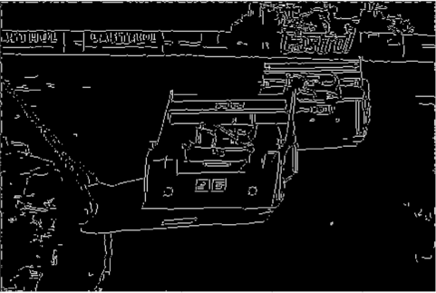
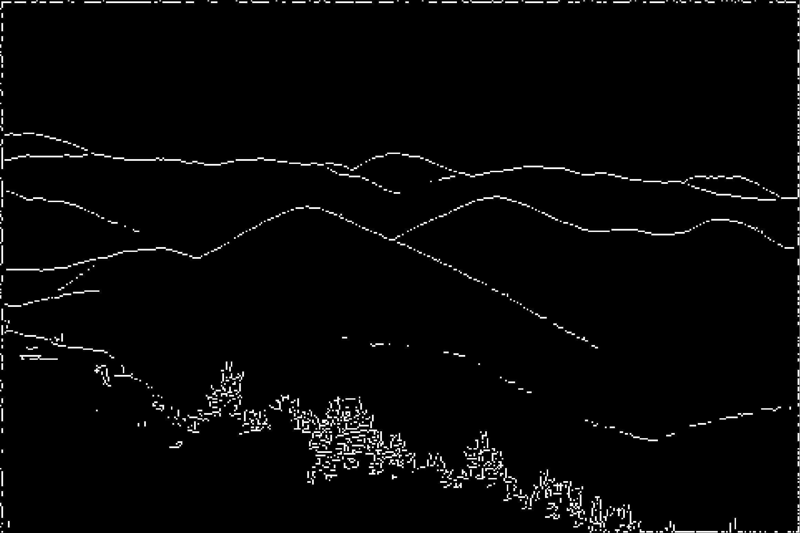

## Canny Edge Detection

The goal of this project is to compute Canny Edges for any RGB image. The result was generated using the following steps:

1. The script findDerivatives.py applies Gaussian smoothing and computes local egde gradient magnitude as well as orientation

2. The script nonMaxSup.py finds if the pixel is the local maximum edge pixel in the corresponding orientation.

3. The script edgeLink.py uses hysterisis edge linking to link edges based on high and low magnitude thresholds.

4. The wrapper function cannyEdge.py calls these functions in order and then displays the final image.

To run the code just type python cannyEdge.py and make sure that all the images you want to test on are in the canny_dataset folder.

Some of the results on the images I tested on are as follows:

  
   

  
   

  
   

